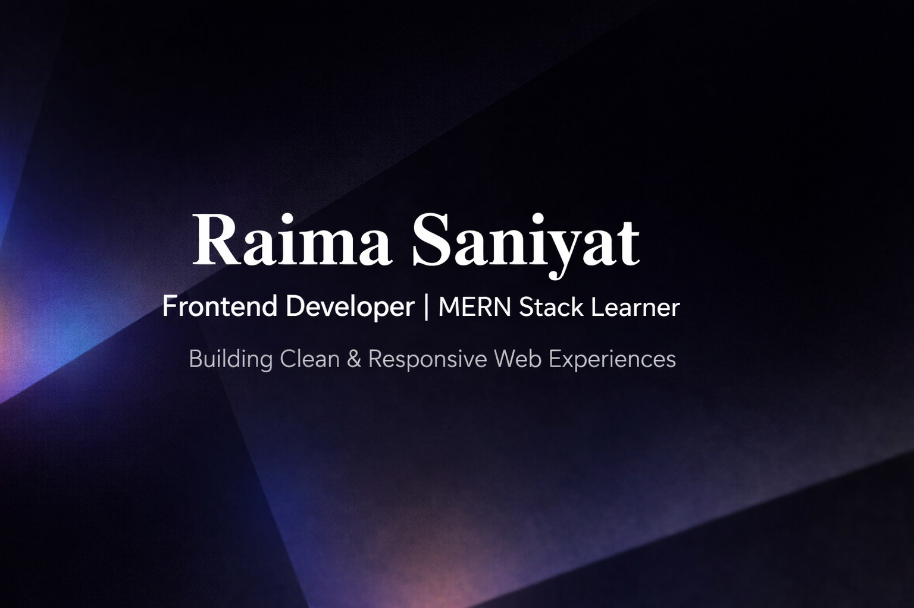

  

# 👋 Hi, I'm Raima Saniyat

### 🚀 CSE Student | Frontend Developer

---

## 🧠 About Me

I’m an undergraduate Computer Science and Engineering student focused on building real-world, production-level web development skills.

I specialize in crafting responsive, user-friendly interfaces and continuously work toward mastering the MERN stack.

* 🎯 Frontend-focused developer with strong UI/UX sense
* ⚡ Skilled in JavaScript (DOM & ES6), Tailwind CSS, and WordPress
* 💡 Passionate about building interactive and efficient web experiences

---

## 🔭 Current Activities

* 🌱 Learning **React.js** and **Next.js**
* 🛠️ Building responsive and user-friendly web applications
* 🚀 Planning to explore backend development (Node.js, APIs)

---

## 🧩 Skills

### 💻 Programming

  

### ⚙️ Frameworks & Tools

  

### 🌐 Other

  

---

## 🌐 Connect with Me

  
  

---

## 📊 GitHub Stats

  

  

  

---

⭐ *Always learning, building, and improving.*
